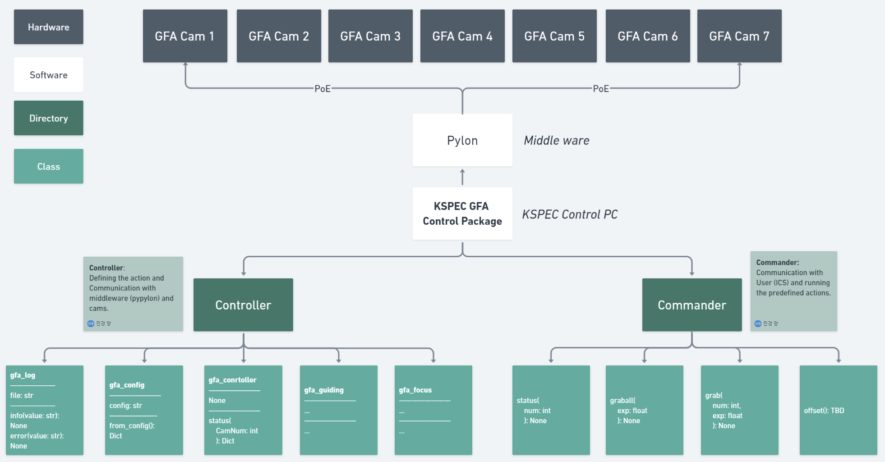

# kspec_gfa_controller


[](https://pypi.org/project/kspec-gfa-controller/)

[](https://kspec-gfa.readthedocs.io/en/latest/?badge=latest)

# The KSPEC GFA Camera Controller
- KSPEC-GFA is a tool for guiding, focusing, and acquisition sequence control in KSPEC observation.
- The Controller communicate with Basler Guide cameras for guiding and focusing processes.
- The Controller use the [pypylon](https://github.com/basler/pypylon) library as the middleware for the communication.

# Getting Started

## Installation

`kspec-gfa` can be installed using by cloning this repository

```console
git clone https://github.com/mmingyeong/kspec_gfa.git
```

## Quick Start

```console
cd kspec_gfa_controller/controller/main.py
python main.py
```

## Software Architecture

Here is the Software Architecture diagram explaining the hierarchy of KSPEC-GFA.

